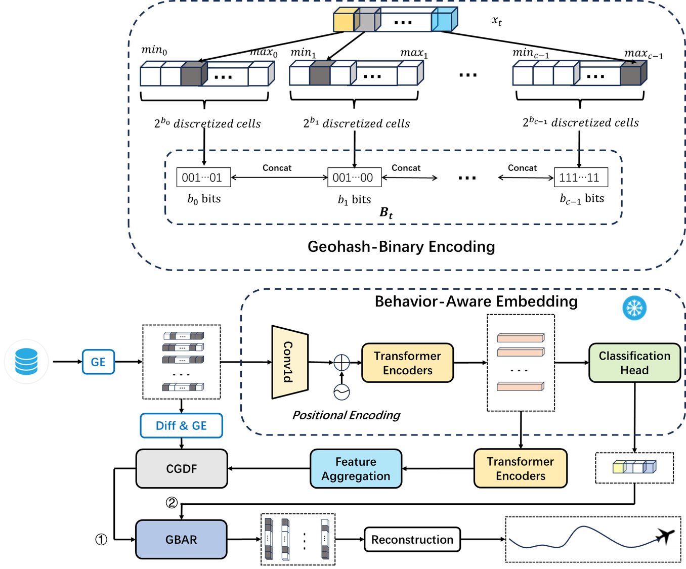

# A Pretrained Behavior-Embedded Framework for Flight Trajectory Prediction via Geohash-Binary Encoding

This is the official implementation of the paper: "A Pretrained Behavior-Embedded Framework for Flight Trajectory Prediction via Geohash-Binary Encoding".

---

## 🏗️ Framework Architecture

## 📢 Announcement on Code Availability

To support the reproducibility of the research while maintaining the integrity of the ongoing peer-review and publication process, the source code availability is organized as follows:

* **Full Source Code**: The complete training pipelines, pretrained weights, and specialized preprocessing tools for the NASA Dashlink and SCAT datasets will be made **fully available** upon the **official publication** of this paper.
* **Current Release (Pre-publication)**:
    * **Execution Scripts**: A complete set of running scripts demonstrating the core logic of the proposed framework, including the **Geohash-binary encoding** and the **Global Behavior-Aware Refinement (GBAR)** modules.
    * **Reproduced Baselines**: Implementations of several state-of-the-art baseline models reproduced from their original papers to facilitate comparative studies.

---

## 🚀 Key Features

* **Geohash-Binary Encoding**: A unified, scale-consistent representational space for heterogeneous engineering data.
* **Behavior-Embedded Framework**: Capturing discriminative flight priors through a parameter-shared pretraining module.
* **Generative Refinement (GBAR)**: A CVAE-based module for high-precision predictive distribution calibration.

---

## 🛠️ Usage (Coming Soon)

Detailed instructions for environment setup and running the provided scripts will be updated shortly.